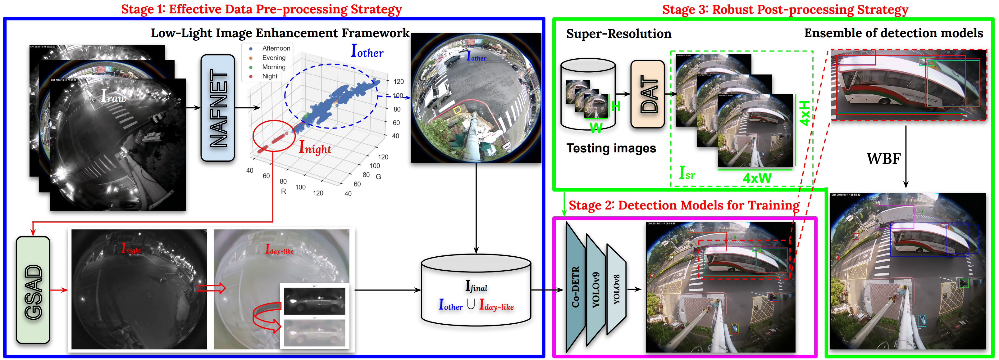
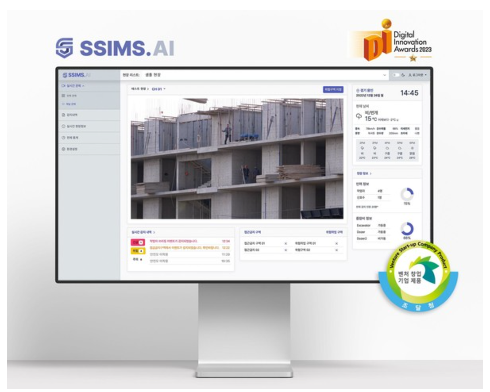
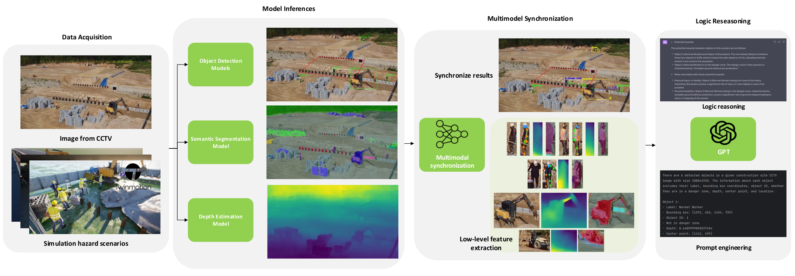
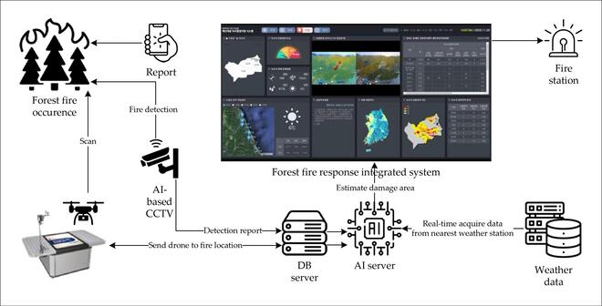
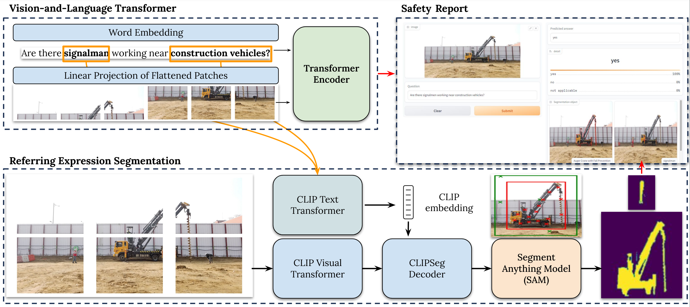

# Working Projects
## AI-based CCTV System for Monitoring Construction Sites

## Low-Light Image Enhancement Framework for Improved Object Detection in Fisheye Lens Datasets

## SSIMS.AI for SmartInside.AI

## Image-to-Hazard: GPT-based Logic Reasoning for Hazard Identification in Construction Site using CCTV Data

## Forest-Fire Response System

## VQA-RESCon

