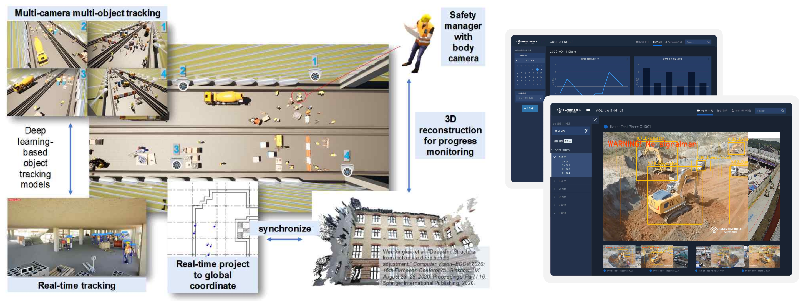

# Working Projects

## **AI-based CCTV System for Monitoring Construction Sites**
**Role:** Principal Investigator  
**Budget:** 210,000,000 WON  
**Duration:** March 2023 - Present  
**Description:** Received a three-year project grant from the National Research Foundation of Korea (NRF) to develop an AI-based CCTV system for monitoring construction sites.  

## **Deep Learning-Based Object Detection in Construction Sites**
**Role:** AI Team Lead  
**Company:** SmartInside AI Co., Ltd, Suwon, Korea  
**Duration:** February 2021 - Present  
**Description:** Implementing and optimizing deep learning-based object detection algorithms for detecting objects in construction sites using CCTV data. Developing modules for extracting object features and ensemble models for extracting information from specific case studies.

## **Safety Management Research in Construction**
**Role:** Research Assistant  
**Lab:** Smart Construction IT Lab., Sungkyunkwan University, Suwon, Korea  
**Duration:** September 2018 - February 2023  
**Description:** Conducted research using object detection based on deep learning and CCTV data for safety management in construction. Utilized CCTV, UAV images, and weather data to estimate forest-fire damaged areas. Developed deep learning models for ultrasonic wave propagation imaging-based damage detection in structures.

## **Research Assistant at National Institute of Technology, Gifu College, Japan**
**Duration:** August 2017  
**Description:** Conducted various research projects during my assistantship.
